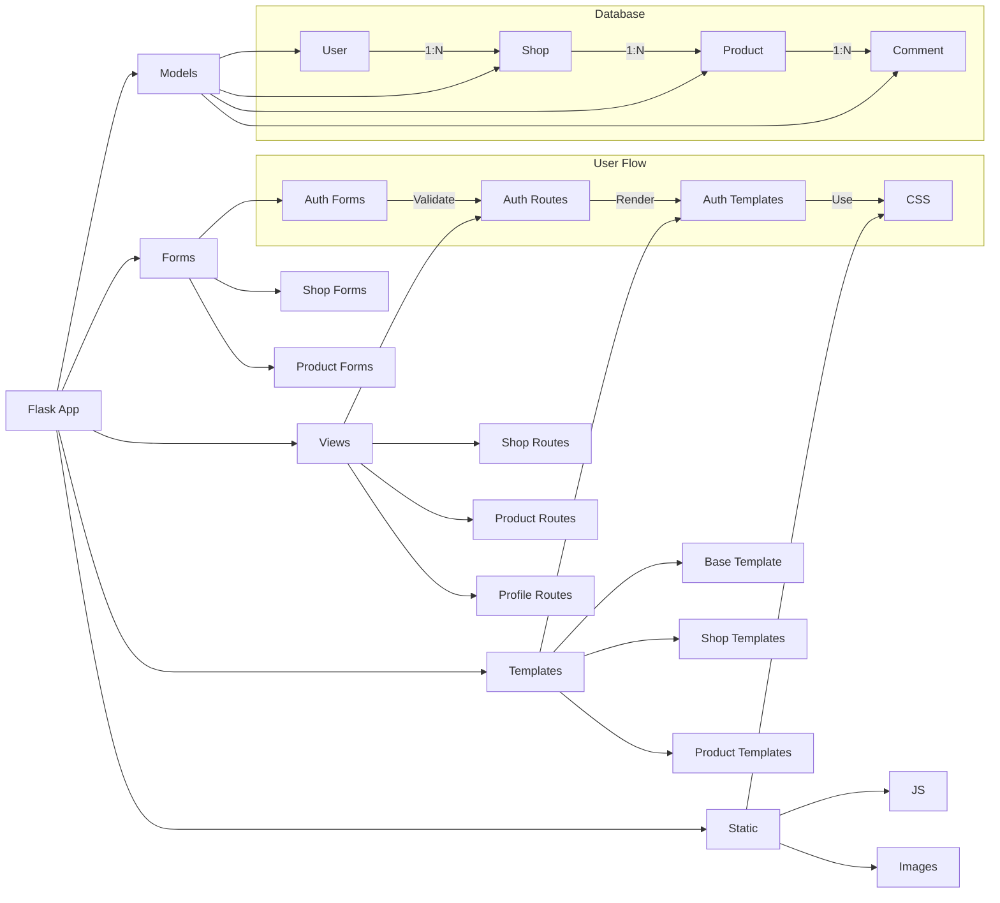

```mermaid
flowchart TD
    A[Flask Интернет-Магазин] --> B[Ядро системы]
    A --> C[Модели данных]
    A --> D[Формы]
    A --> E[Контроллеры]
    A --> F[Шаблоны]
    A --> G[Статика]
    
    B --> B1[app/__init__.py]
    B --> B2[config.py]
    B --> B3[run.py]
    
    C --> C1[User]
    C --> C2[Shop]
    C --> C3[Product]
    C --> C4[Comment]
    
    D --> D1[LoginForm]
    D --> D2[RegisterForm]
    D --> D3[ShopForm]
    D --> D4[ProductForm]
    D --> D5[CommentForm]
    
    E --> E1[Аутентификация]
    E --> E2[Магазины]
    E --> E3[Товары]
    E --> E4[Профиль]
    E --> E5[Дополнительное]
    
    F --> F1[base.html]
    F --> F2[index.html]
    F --> F3[auth/]
    F --> F4[shop/]
    F --> F5[product/]
    F --> F6[account/]
    
    G --> G1[css/style.css]
    G --> G2[js/main.js]
    G --> G3[uploads/]
    
    %% Детализация моделей
    C1 --> C11[id]
    C1 --> C12[email]
    C1 --> C13[password_hash]
    C1 --> C14[shops]
    C1 --> C15[comments]
    
    C2 --> C21[id]
    C2 --> C22[name]
    C2 --> C23[user_id]
    C2 --> C24[products]
    
    C3 --> C31[id]
    C3 --> C32[title]
    C3 --> C33[description]
    C3 --> C34[price]
    C3 --> C35[image]
    C3 --> C36[shop_id]
    C3 --> C37[comments]
    
    %% Детализация контроллеров
    E1 --> E11[/login GET,POST]
    E1 --> E12[/register GET,POST]
    E1 --> E13[/logout GET]
    
    E2 --> E21[/shop/create GET,POST]
    E2 --> E22[/shop/<int:shop_id> GET]
    E2 --> E23[/shop/manage/<int:shop_id> GET]
    
    E3 --> E31[/shop/<int:shop_id>/add GET,POST]
    E3 --> E32[/product/<int:product_id> GET,POST]
    E3 --> E33[/product/<int:product_id>/delete POST]
    
    E4 --> E41[/account GET]
    E4 --> E42[/account/edit GET,POST]
    E4 --> E43[/account/change_password GET,POST]
    
    E5 --> E51[/ GET]
    E5 --> E52[/search GET]
    
    %% Детализация шаблонов
    F3 --> F31[login.html]
    F3 --> F32[register.html]
    
    F4 --> F41[create_shop.html]
    F4 --> F42[manage_shop.html]
    F4 --> F43[shop.html]
    
    F5 --> F51[add_product.html]
    F5 --> F52[product.html]
    
    F6 --> F61[account.html]
    F6 --> F62[edit_profile.html]
    F6 --> F63[change_password.html]
    
    %% Связи между компонентами
    B1 -->|Инициализирует| C
    B1 -->|Использует| D
    B1 -->|Регистрирует| E
    
    E -->|Использует| C
    E -->|Использует| D
    E -->|Рендерит| F
    
    F -->|Наследует| F1
    F -->|Подключает| G
```

### Альтернативный вариант (более компактный):


