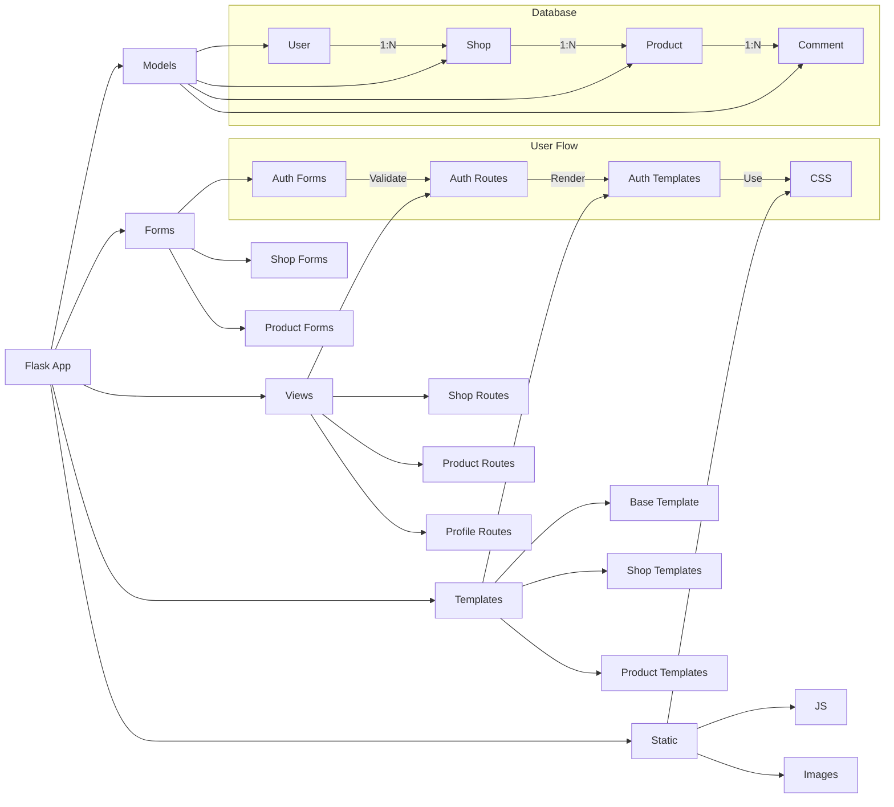

```mermaid
flowchart LR
    A[Flask App] --> B[Models]
    A --> C[Forms]
    A --> D[Views]
    A --> E[Templates]
    A --> F[Static]
    
    B --> B1[User]
    B --> B2[Shop]
    B --> B3[Product]
    B --> B4[Comment]
    
    C --> C1[Auth Forms]
    C --> C2[Shop Forms]
    C --> C3[Product Forms]
    
    D --> D1[Auth Routes]
    D --> D2[Shop Routes]
    D --> D3[Product Routes]
    D --> D4[Profile Routes]
    
    E --> E1[Base Template]
    E --> E2[Auth Templates]
    E --> E3[Shop Templates]
    E --> E4[Product Templates]
    
    F --> F1[CSS]
    F --> F2[JS]
    F --> F3[Images]
    
    subgraph "Database"
        B1 -->|1:N| B2
        B2 -->|1:N| B3
        B3 -->|1:N| B4
    end
    
    subgraph "User Flow"
        C1 -->|Validate| D1
        D1 -->|Render| E2
        E2 -->|Use| F1
    end
```
